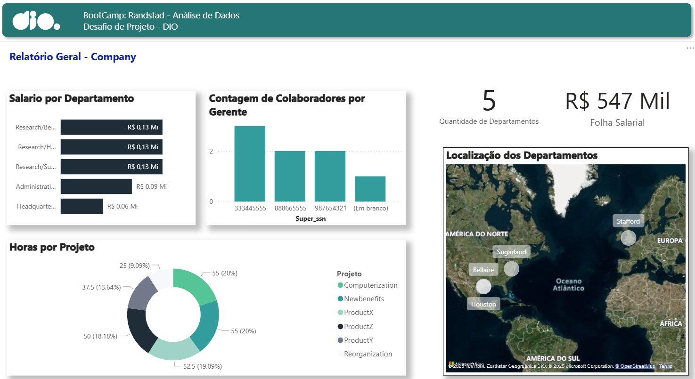
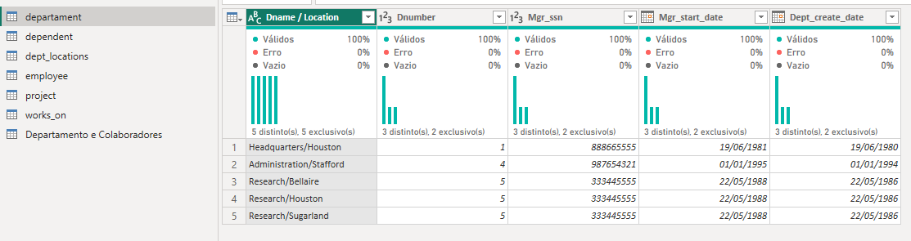

# 📊 Desafio: Integração de Dados com MySQL Azure e Transformação com Power BI
Este projeto tem como objetivo integrar uma base de dados hospedada em uma instância MySQL na Azure com o Power BI, realizando transformações e modelagens para análise estratégica. A proposta simula um cenário corporativo de estruturação de dados, com foco em qualidade, consistência e preparação para visualizações analíticas.

## 🔍 Prévia do Relatório

  
## 🎯 Objetivos do Projeto

- Criar uma instância MySQL na Azure e configurar acesso seguro  
- Conectar o banco de dados ao Power BI para análise  
- Realizar transformações nos dados para garantir integridade e usabilidade  
- Identificar inconsistências e aplicar correções lógicas  
- Preparar os dados para futura modelagem em estrela  

## 💡 Funcionalidades e Etapas Realizadas

- Criação de instância MySQL na Azure com configuração de firewall  
- Conexão via Cloud Shell e MySQL Workbench  
- Importação da base de dados disponível no GitHub  
- Integração direta com Power BI Desktop
- 
### 🔄 Transformações Aplicadas
- Ajuste de tipos de dados e tratamento de valores nulos  
- Mesclagem de colunas e tabelas (ex: nome completo, departamento-gerente)  
- **Criação de coluna única combinando Departamento e Localização**  
  - Foi utilizada a função de **mesclar colunas** no Power Query para unir os campos `Departamento` e `Localização`, formando uma chave única como `"Headquartes / Houston"`.
    
  - Essa abordagem é essencial para garantir **unicidade** na combinação e facilitar a criação de uma **dimensão no modelo estrela**.
  - Optou-se por **mesclar** ao invés de **atribuir** porque:
    - Mesclar é mais direto e menos propenso a erros manuais.
    - Garante que o valor combinado seja tratado como uma **entidade única**.
    - Evita ambiguidade na modelagem e melhora a consistência dos dados.

## ⚙️ Tecnologias Utilizadas
-  Microsoft Azure – Hospedagem e gerenciamento do banco MySQL 
-  MySQL Workbench – Acesso e manipulação do banco de dados
-  Power BI Desktop – Transformação e visualização dos dados 
-  Power BI Service – Publicação e compartilhamento do relatório

## 📥 Como Reproduzir
1. Clone este repositório ou baixe os arquivos disponíveis  
2. Crie uma instância MySQL na Azure conforme instruções  
3. Importe a base de dados via script SQL  
4. Configure o acesso ao banco via Workbench ou Cloud Shell  
5. Conecte o Power BI ao banco MySQL e aplique as transformações descritas  
6. Explore os dados e crie visualizações conforme necessidade  

## 📌 Observações

- Este projeto foi desenvolvido com fins acadêmicos e profissionais, como parte de um desafio da plataforma DIO  
- O objetivo é demonstrar habilidades em cloud computing, SQL, ETL e visualização de dados com Power BI, compondo o portfólio e currículo técnico  

## 🗂️ Base de Dados
Scripts utilizados para inserção e manipulação dos dados:
- `insercao_de_dados_e_queries_sql.sql`  
- `script_bd_company.sql`
